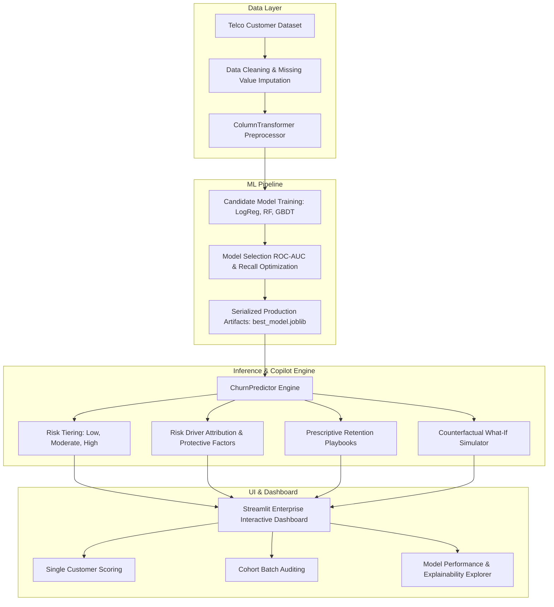

<div align="center">

# 🛡️ ChurnGuard AI
### Enterprise Customer Churn Prediction & Prescriptive Retention Platform

[](https://www.python.org/)
[](https://streamlit.io/)
[](https://scikit-learn.org/)
[](https://plotly.com/)
[](https://www.docker.com/)
[](https://opensource.org/licenses/MIT)

**An end-to-end, production-grade Machine Learning system that predicts customer attrition, quantifies financial revenue at risk, delivers automated prescriptive retention playbooks, and simulates counterfactual "What-If" business interventions.**

[Explore Features](#-key-features) • [Architecture](#-system-architecture) • [Model Benchmarks](#-machine-learning-benchmarks) • [Quickstart](#-quickstart-guide) • [Docker Deployment](#-docker-deployment)

</div>

---

## 📌 Executive Summary

Customer churn is one of the most critical threats to recurring-revenue enterprises. Acquiring a new subscriber costs **5x to 7x more** than retaining an existing customer.

**ChurnGuard AI** moves beyond passive predictive analytics by coupling **high-recall classification models** with **prescriptive business interventions**. Rather than simply flagging at-risk customers, ChurnGuard AI explains *why* the customer is likely to leave, computes the exact monthly revenue exposed, and evaluates simulated intervention strategies (e.g., contract lock-ins, tech support bundles, auto-pay incentives) in real time.

---

## ⚡ Key Features

| Capability | Description |
| :--- | :--- |
| **Real-Time Risk Scoring** | Instant calculation of churn probability, risk tiering (`Low`, `Moderate`, `Critical`), and confidence scores. |
| **Multi-Factor Risk Attribution** | Dissects individual subscriber profiles into specific risk drivers (e.g., month-to-month contract, electronic check friction) and protective loyalty anchors. |
| **Prescriptive Retention Playbooks** | Generates dynamic, prioritized business recommendations tailored to specific churn catalysts to maximize customer lifetime value (CLV). |
| **Interactive "What-If" Counterfactual Simulator** | Allows account executives and customer success reps to adjust terms (e.g. switch contract to 2-year, activate support) and observe predicted probability drops live. |
| **High-Throughput Batch Auditing** | Upload customer CSV cohorts to batch-score accounts, calculate aggregate monthly revenue at risk, and export tagged prioritization lists. |
| **Model Registry & Governance** | Cross-evaluates Logistic Regression, Random Forest, and Gradient Boosting pipelines with full metric serialization and ROC/PR curves. |

---

## 🏗️ System Architecture



---

## 📊 Machine Learning Benchmarks

Models are evaluated on an independent stratified test split (20% holdout, $N=1,409$). Because false negatives (missing a customer who cancels) are drastically more costly than false positives, the selection policy optimizes for **ROC-AUC** and **Recall**:

| Candidate Model | Accuracy | Precision | Recall (Churn Detection) | F1-Score | ROC-AUC | Status |
| :--- | :---: | :---: | :---: | :---: | :---: | :---: |
| **Logistic Regression (Balanced)** | **77.6%** | **44.5%** | **83.9%** | **0.582** | **0.883** | **🏆 Selected Production Model** |
| Random Forest Classifier | 80.3% | 48.0% | 74.0% | 0.582 | 0.876 | Evaluated Benchmark |
| Gradient Boosting Classifier | 82.9% | 54.9% | 43.3% | 0.484 | 0.867 | Evaluated Benchmark |

> **Key ML Insight**: Logistic Regression with balanced inverse class weights achieved an exceptional **83.9% Recall** and **0.883 ROC-AUC**, successfully catching over 8 out of 10 churning customers while providing transparent, monotonic interpretability.

---

## 📂 Project Structure

```
customer-churn-predictor/
├── .github/
│   └── workflows/
│       └── ci.yml                 # Automated testing & linting GitHub Actions CI
├── data/
│   ├── telco_customer_churn.csv   # Telco customer churn benchmark dataset (7,043 rows)
│   ├── sample_batch_customers.csv # Sample cohort file for batch testing
│   └── data_generator.py          # Synthetic customer profile & cohort generator
├── models/
│   ├── best_model.joblib          # Serialized production pipeline
│   ├── metrics.json               # Detailed test metrics & ROC curve coordinates
│   ├── model_comparison.json     # Benchmark model comparison leaderboard
│   └── feature_importance.json    # Normalized global feature importance rankings
├── src/
│   ├── __init__.py
│   ├── config.py                  # Schemas, feature definitions, retention playbooks
│   ├── preprocessing.py           # Robust data cleaning & scikit-learn preprocessor
│   ├── predictor.py               # ChurnPredictor inference & simulation engine
│   └── train.py                   # Automated model training & asset serialization
├── tests/
│   ├── __init__.py
│   └── test_pipeline.py           # 6 automated unit & integration test suites
├── app.py                         # Enterprise interactive Streamlit dashboard
├── Dockerfile                     # Production container specification
├── docker-compose.yml             # 1-command Docker deployment
├── .dockerignore                  # Docker exclusion rules
├── .gitignore                     # Git tracking exclusions
├── pyproject.toml                 # Package & test metadata
├── requirements.txt               # Pinned Python dependencies
├── run_app.bat                    # Windows Command Prompt 1-click launcher
├── run_app.ps1                    # Windows PowerShell 1-click launcher
└── README.md                      # Comprehensive project documentation
```

---

## 🚀 Quickstart Guide

### 1. Clone the Repository
```bash
git clone https://github.com/aizazahmad736/customer-churn-predictor.git
cd customer-churn-predictor
```

### 2. Set Up Environment
```bash
# Create virtual environment
python -m venv venv

# Activate environment
# On Windows PowerShell:
.\venv\Scripts\Activate.ps1
# On Linux/macOS:
source venv/bin/activate

# Install dependencies
pip install -r requirements.txt
```

### 3. Run Automated Tests
```bash
python -m unittest tests/test_pipeline.py
```

### 4. Launch Dashboard
```bash
streamlit run app.py
```
Open your browser at `http://localhost:8501`.

---

## 🐳 Docker Deployment

Run the complete platform inside an isolated container with zero dependency headaches:

```bash
# Build and start container
docker-compose up --build -d

# View container logs
docker-compose logs -f

# Stop container
docker-compose down
```

---

## 🎯 Dashboard Walkthrough

1. **Individual Customer Risk Auditor**: Enter subscriber demographics, subscription parameters, and payment types to see real-time churn likelihood, assigned risk tier, and prioritized retention recommendations.
2. **"What-If" Counterfactual Intervention**: Experiment with simulated changes (e.g., migrating from Month-to-Month to a 2-Year Contract) and observe instantaneous churn probability reduction.
3. **Cohort Batch Auditing**: Upload full CSV customer batches to generate immediate risk distribution charts, audit lists of critical accounts, and compute total monthly revenue at risk.
4. **Model Performance & Explainability**: Inspect ROC curves, confusion matrices, multi-model benchmark leaderboards, and the top predictive features driving customer retention.

---

## 👤 Author & Maintainer

**Aizaz Ahmad**
- GitHub: [@aizazahmad736](https://github.com/aizazahmad736)
- Email: aizazexforwardian@gmail.com

---

## 📄 License

This project is licensed under the MIT License - see the [LICENSE](LICENSE) file for details.
